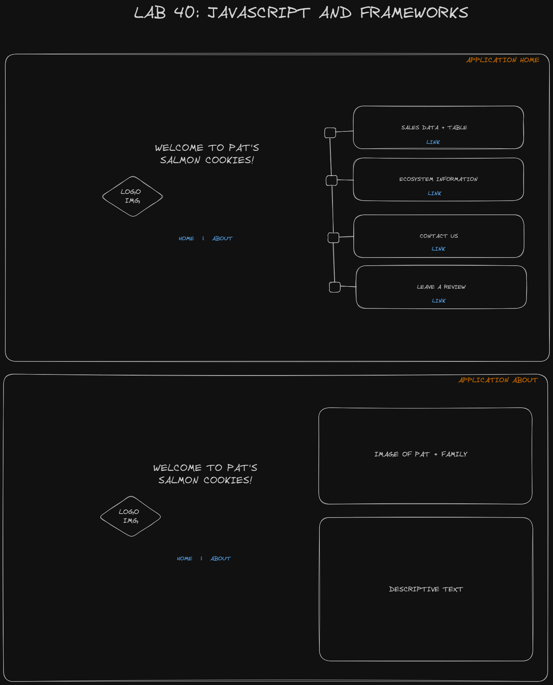

# LAB - Class 40

## Project: Vue - Salmon Cookies

### Author: Ryan Eastman, Kao Saelor, Kenya Womack, Coriana Williams

### Problem Domain  

For the purposes of educating your class/teammates, your group will implement the “Salmon Cookies” application using your assigned framework, with all features from the original assignment.

Assume, for this assignment, that your employer has asked your team to do a proof of concept of a javascript framework, to assess it’s viability as a replacement for their legacy system. Your task will be to complete a full analysis report and give a presentation to the class as to your findings.

### Links and Resources

- [GitHub Actions ci/cd](https://github.com/DocHolliday13x/vue-salmoncookies/actions)
- [front-end application](https://vue-salmoncookies.netlify.app/)

- [Testing w/Vue.js](https://v2.vuejs.org/v2/cookbook/unit-testing-vue-components.html)
- [Vue Test Utils](https://v1.test-utils.vuejs.org/guides/)
- [Vue CLI](https://cli.vuejs.org/core-plugins/unit-jest.html#configuration)

### Setup

1. We created the application using the Vue.js framework.
2. `npm init vue@latest`
3. We then had to choose optional features.
4. Then we cd into the directory and run `npm install` to install all the dependencies.
5. We gather proof of life by running `npm run dev` to make sure the application is running.
6. We then created a repository on GitHub and pushed our code to it.
7. We then created a Netlify account and connected it to our GitHub repository.

### `.env` requirements (where applicable)

For now, we have none and do not require one.

### How to initialize/run your application (where applicable)

1. Clone the repository to your local machine.
2. Run `npm install` to install all dependencies.
3. Run `npm run dev` to start the application.

### Features / Routes

- Feature One: Details of feature
- GET : `/hello` - specific route to hit

### Tests

- *How do you run tests?*

  - `npm run test:unit` should be the command to run tests, but it's a nightmare to get it to work and the docs are virtually useless in this regard.
- *Any tests of note?*

  - The goal was to test the table component for starters, but we couldn't get the tests to run.

- *Describe any tests that you did not complete, skipped, etc*

  - Even with the assistance of ChatGPT, we were unable to produce any form of tests for this application. There is an absolute plethora of reasons as to why this might be, even after virtually uninstalling and force reinstalling every possible dependency, json.package and node modules. I will include the list of known issues below, but I'm sure there are more that I'm not aware of.

- *List of known testing problems with Vue.js:*

1. Use a testing framework: Popular testing frameworks for Vue.js include Jest, Mocha, and Karma. These frameworks provide utilities and tools specifically designed for testing Vue.js applications.

2. Mock dependencies: To isolate components during testing, use mocks or stubs for external dependencies, such as API requests or external libraries. This helps ensure that tests focus on the specific component under test.

3. Utilize testing utilities: Vue provides testing utilities like vue-test-utils that simplify the process of rendering components, interacting with them, and making assertions. These utilities make it easier to write clean and effective tests.

4. Write comprehensive tests: Test all possible scenarios and edge cases to ensure adequate coverage. This includes testing component rendering, user interactions, computed properties, async behavior, and Vuex store mutations/actions.

5. Follow test-driven development (TDD) principles: Write tests before implementing functionality to ensure code correctness and maintainability. TDD helps catch issues early in the development process and ensures that tests remain up-to-date.

### UML

- 

### JS Framework Comparative Analysis

**Framework Name:** Vue.js

**Research Conducted By:** Ryan Eastman, Kao Saelor, Kenya Womack, Coriana Williams

**Overall Score and Comments:**
Score (Out of 10): 4

**General Comments**
Vue.js is a progressive framework for building user interfaces. Unlike other monolithic frameworks, Vue is designed from the ground up to be incrementally adoptable. The core library is focused on the view layer only, and is supposedly easy to pick up and integrate with other libraries or existing projects. On the other hand, Vue is also perfectly capable of powering sophisticated Single-Page Applications when used in combination with modern tooling and supporting libraries. Because it's so terrible to attempt testing with, I cannot in good faith recommend this framework to anyone. It's a nightmare to work with and the documentation is virtually useless. I would rather use React.js or Angular.js over this framework any day of the week.

**Describe the stack (front-end only? full stack?), database, efficiency, etc. Describe the general usability and learnability.**
Our application is a front-end only, full stack application. It is very similar to React.js. It is somewhat user-friendly in regard to picking it up and learning to utilize it. I can't speak about the level of difficulty required to integrate this with other libraries or existing projects, becuase we built it from scratch simply referncing the prior version of Salmon Cookies that we built earlier in tandom with the documentation provided by Vue.js.

**Pros:**

- Simplicity
- Appealing Stylization

**Cons:**

- Documentation is a little less in depth than than other frameworks.
- Not as popular as other frameworks.
- Testing virtually impossible to implement.

**Ratings and Reviews:**

**Documentation:**
Thoughts go here

**Systems Requirements:**

- *What is required to run this framework?* To run this framework, you need to have Node.js installed on your machine.
- *What systems did you test this framework on (PC, Mac, Linux, etc.)?* We tested this framework on Windows 11 Pro with WSL2.
- *What tools (editor, IDE, unit testing, etc.) did you use to develop this framework?* We used VS Code as our IDE and GitHub for version control.

**Documentation:**
*Above and beyond ‘node’ and ‘linux’, what dependencies or core requirements exist for this framework? Is it easily deployable to the cloud? Does it require a certain database?* Some additional dependencies such as Vue Router, Vuex, and Vue CLI are required to build a full stack application. It is easily deployable to the cloud. It does not require a certain database.

**Ramp-Up Projections:**
*How long would/should it take a team of mid-junior developers to become productive?* It would take a team of mid-junior developers about 2 weeks to become productive.

**Community Support and Adoption levels:**
*How popular is this framework? What big companies are running on it? How is it “seen” in the general JS community? Is there an active community of developers supporting and growing it?* Vue.js is not as popular as other frameworks, but it is still widely used. Some big companies that use Vue.js are GitLab, Alibaba, and Nintendo. It is seen as a good framework in the general JS community. There is an active community of developers supporting and growing it. I intend to contribute to it via open source projects in the near future.

**Links and Resources:**

- [Vue.js](https://vuejs.org/)
- [Tables in Vue](https://vuejsexamples.com/tag/table/)

**Code Demos:**

- [Deployed Site](https://vue-salmoncookies.netlify.app/)
- [Repo](https://github.com/DocHolliday13x/vue-salmoncookies)

**Operating Instructions:**

- Clone the repository to your local machine.
- Run `npm install` to install all dependencies.
- Run `npm run dev` to start the application.
